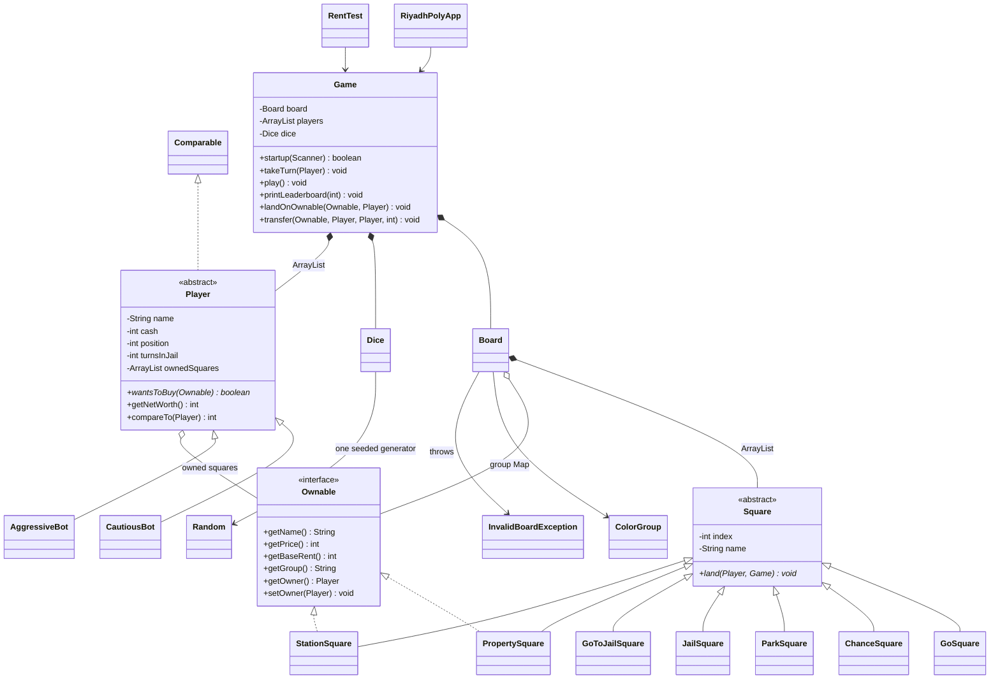

# Implemented Phase 2 class design

The original draw.io file is the supplied whole-project plan, including future
Phase 3 classes. This diagram covers the implementation at Phase 2.

```mermaid
classDiagram
    Square <|-- GoSquare
    Square <|-- ChanceSquare
    Square <|-- ParkSquare
    Square <|-- JailSquare
    Square <|-- GoToJailSquare
    Square <|-- PropertySquare
    Square <|-- StationSquare
    Ownable <|.. PropertySquare
    Ownable <|.. StationSquare
    Player <|-- CautiousBot
    Player <|-- AggressiveBot
    Comparable <|.. Player
    Game *-- Board
    Game *-- Dice
    Game *-- Player : ArrayList
    Board *-- Square : ArrayList
    Board o-- Ownable : group Map
    Player o-- Ownable : owned squares
    Dice --> Random : one seeded generator
    Board --> ColorGroup
    Board --> InvalidBoardException : throws
    RiyadhPolyApp --> Game
    RentTest --> Game
    class Square {
        <<abstract>>
        -int index
        -String name
        +land(Player, Game)* void
    }
    class Ownable {
        <<interface>>
        +getName() String
        +getPrice() int
        +getBaseRent() int
        +getGroup() String
        +getOwner() Player
        +setOwner(Player) void
    }
    class Player {
        <<abstract>>
        -String name
        -int cash
        -int position
        -int turnsInJail
        -ArrayList ownedSquares
        +wantsToBuy(Ownable)* boolean
        +getNetWorth() int
        +compareTo(Player) int
    }
    class Game {
        -Board board
        -ArrayList players
        -Dice dice
        +startup(Scanner) boolean
        +takeTurn(Player) void
        +play() void
        +printLeaderboard(int) void
        +landOnOwnable(Ownable, Player) void
        +transfer(Ownable, Player, Player, int) void
    }
```
